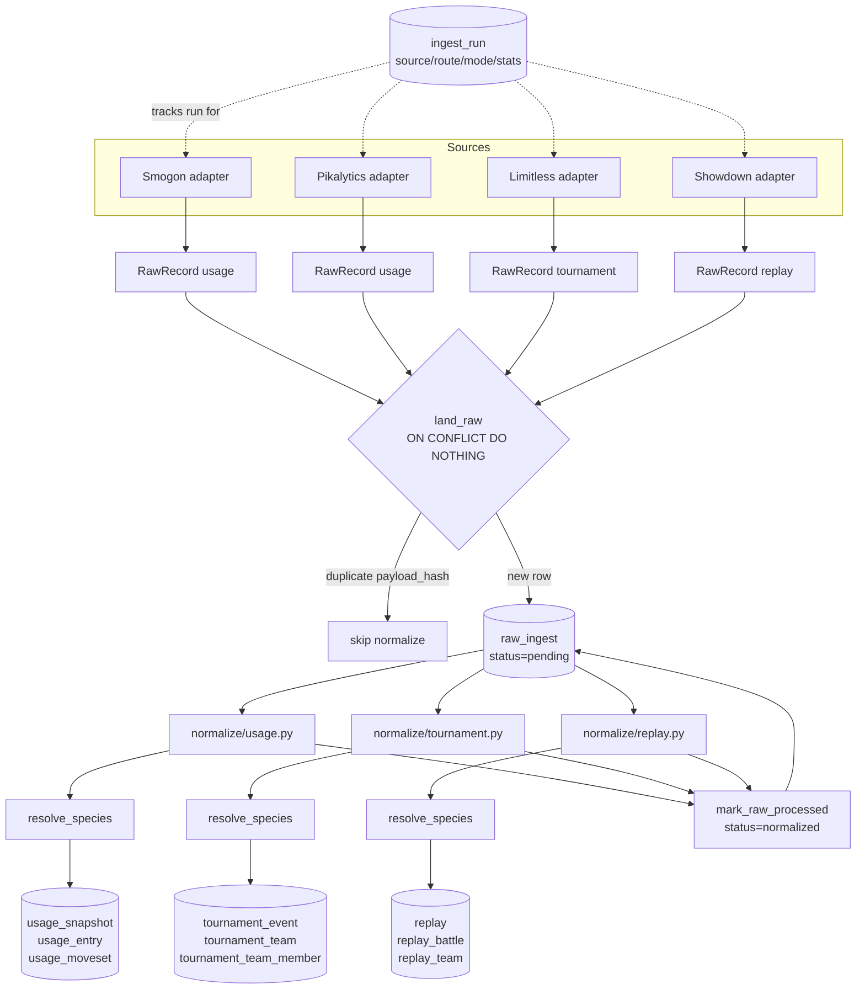

# Competitive Pokémon Data Platform — Architecture

Source of truth for schema claims below: `src/platform/store/migrations/0001_init.sql`
and `src/platform/store/repositories.py`. Code lives in `src/platform/`.

## Architecture overview

Store-raw-first, normalize-later. Three layers, strictly separated:

1. **`sources/`** — one HTTP adapter per source (Smogon, Pikalytics, Limitless,
   Showdown). Each implements `SourceAdapter.fetch(**kwargs) -> Iterable[RawRecord]`
   (`sources/base.py`). Adapters know nothing about Postgres or canonical tables —
   they only emit `RawRecord(route, natural_key, payload, url)`.
2. **`store/`** — `land_raw()` (idempotent insert into `raw_ingest`) and a set of
   `upsert_*`/`resolve_species` helpers in `repositories.py`. `db.py` owns a
   module-global `asyncpg.Pool` (`get_pool()`) and a plain-SQL migration runner
   (`migrate()`) that tracks applied files in a `schema_migration(filename)` ledger
   — no ORM, no Alembic.
3. **`normalize/`** — one module per route (`usage.py`, `tournament.py`,
   `replay.py`) that reads pending `raw_ingest` rows and writes canonical tables.
   Normalizers are the *only* writers of canonical data; this is what keeps species
   normalization (`_normalized_key`) isolated from the fetch code in `sources/`.

DB connection: `PLATFORM_DATABASE_URL` (raw asyncpg DSN, `src/platform/config.py`).
Deliberately separate from the legacy bot's SQLite `DATABASE_URL`.

## 3-route schema map

| Route | Source(s) | Canonical chain |
|---|---|---|
| `tournament` | Limitless | `tournament_event` → `tournament_team` → `tournament_team_member` |
| `usage` | Smogon, Pikalytics | `usage_snapshot` → `usage_entry` → `usage_moveset` |
| `replay` | Showdown | `replay` → `replay_battle` → `replay_team` |

`source.kind` and `raw_ingest.route`/`ingest_run.route` all share the same
`CHECK (... IN ('tournament','usage','replay'))` vocabulary.

## Table list + relationships

**Infra**
- `source(id, name UNIQUE, kind)` — 4 seed rows: smogon/pikalytics(usage),
  limitless(tournament), showdown(replay).
- `raw_ingest(id, source_id→source, route, natural_key, url, payload JSONB,
  payload_hash, status, normalizer_version)` — `UNIQUE(source_id, natural_key,
  payload_hash)`, partial index on `status='pending'`.
- `ingest_run(id, source_id→source, route, mode, started_at, finished_at, status,
  stats JSONB)` — `mode CHECK IN ('periodic','event','replay_targeted')`. Defined,
  not yet written to (see Orchestration section).
- `schema_migration(filename, applied_at)` — created by `db.py::migrate()`, not in
  the SQL file itself.

**Canonical reference**
- `canonical_species(id, slug UNIQUE, national_dex, display_name,
  base_forme_slug, is_forme)`.
- `species_alias(id, canonical_species_id→canonical_species, source_id→source
  nullable, raw_name, normalized_key)` — `UNIQUE(source_id, normalized_key)`.
- `canonical_format(id, slug UNIQUE, label, generation, game_type, regulation)`.

**Route: tournament**
- `tournament_event(..., raw_ingest_id→raw_ingest)` — `UNIQUE(source_id,
  external_id)`.
- `tournament_team(event_id→tournament_event, placement, player_external_id, ...,
  raw_ingest_id)` — `UNIQUE(event_id, placement, player_external_id)`.
- `tournament_team_member(team_id→tournament_team, canonical_species_id, slot,
  item, ability, tera_type, moves JSONB)` — no unique key (delete-before-insert on
  reprocess, see below).

**Route: usage**
- `usage_snapshot(source_id, format_id→canonical_format, period, elo_cutoff,
  sample_size, raw_ingest_id)` — `UNIQUE(source_id, format_id, period,
  elo_cutoff)`.
- `usage_entry(snapshot_id→usage_snapshot, canonical_species_id, rank,
  usage_pct, raw_count)` — `UNIQUE(snapshot_id, canonical_species_id)`.
- `usage_moveset(usage_entry_id→usage_entry, moves/items/spreads/abilities/
  teammates/checks all JSONB)` — no unique key.

**Route: replay**
- `replay(source_id, replay_id TEXT UNIQUE, format_id, players JSONB, rating,
  log_hash, raw_ingest_id)`.
- `replay_battle(replay_id→replay, winner, turn_count, turns JSONB,
  parser_version)` — `UNIQUE(replay_id, parser_version)`.
- `replay_team(replay_battle_id→replay_battle, player_slot,
  canonical_species_id, brought, lead)` — no unique key.

Every canonical row that derives from a fetched payload carries `raw_ingest_id`
back to the exact `raw_ingest` row it came from — full lineage, supports
reprocessing.

## Idempotency + reprocessing

- **Raw landing dedup**: `land_raw()` →
  `INSERT ... ON CONFLICT (source_id, natural_key, payload_hash) DO NOTHING
  RETURNING id`. `None` means an identical payload already landed; callers skip
  normalization.
- **Canonical upserts**: `ON CONFLICT (<unique key>) DO UPDATE` for every table
  that has one (`canonical_species` on `slug`, `usage_snapshot` on its 4-col key,
  `replay` on `replay_id`, `replay_battle` on `(replay_id, parser_version)`, etc.),
  always `RETURNING id`.
- **Keyless child rows** (`usage_moveset`, `tournament_team_member`,
  `replay_team`): no natural unique constraint, so reprocessing does
  `DELETE WHERE <parent_id>=$1` then re-insert.
- **Versioned reprocess**: `replay_battle.parser_version` +
  `UNIQUE(replay_id, parser_version)` means bumping the parser version inserts a
  new row instead of clobbering history; same version overwrites in place.
  `mark_raw_processed()` sets `raw_ingest.status='normalized'` +
  `normalizer_version`.

## Species normalization isolation

Single normalization function, `_normalized_key()` in `normalize/replay.py:20`
(lowercase + alnum-only), imported by `usage.py`, `tournament.py`, and `seed.py` —
fetch code in `sources/` never sees it. Resolution: `resolve_species(conn, source,
raw_name, normalized_key)` in `repositories.py:27` looks up `species_alias` by
`normalized_key`, preferring a source-specific alias then falling back to a
source-NULL global alias (`ORDER BY sa.source_id NULLS LAST`). Returns `None` on
miss — caller leaves `canonical_species_id` NULL rather than crashing.

Seeded once via `python -m src.platform.seed` (`seed.py`): full dex from
`data/pokemon.json` → `canonical_species` + self-alias per species, then Showdown's
`pokemon-showdown/data/aliases.ts` parsed for additional aliases.

## Mermaid ingestion flow



`ingest_run` is dotted because today nothing writes to it — see below.

## Orchestration & sync modes (design)

**Gap**: `sync.py` is a manual argparse CLI (`seed`, `replays --ids`, `usage
--period --formats --cutoff`, `event --ids/--game/--limit/--page`). No scheduler,
no webhook, no cron. `ingest_run` exists with exactly the columns needed
(`mode CHECK IN ('periodic','event','replay_targeted')`) but nothing inserts into
it. No schema change needed to close this gap — orchestration is purely new code.

### Run wrapper

New `src/platform/orchestrate.py`:

```python
async def with_ingest_run(conn, source: str, route: str, mode: str, fn):
    run_id = await conn.fetchval(
        "INSERT INTO ingest_run (source_id, route, mode) "
        "VALUES ((SELECT id FROM source WHERE name=$1), $2, $3) RETURNING id",
        source, route, mode,
    )
    try:
        stats = await fn()
        await conn.execute(
            "UPDATE ingest_run SET finished_at=now(), status='ok', stats=$2 WHERE id=$1",
            run_id, stats,
        )
    except Exception:
        await conn.execute(
            "UPDATE ingest_run SET finished_at=now(), status='error' WHERE id=$1",
            run_id,
        )
        raise
```

`sync.py` subcommands wrap their existing fetch→land→normalize call in this, so
every invocation — manual or scheduled — gets a tracked `ingest_run` row.

### Mode → dispatch table

One dispatch table so all three modes share a single code path, differing only in
how ids/periods are sourced:

| mode | route(s) | id/period source |
|---|---|---|
| `periodic` | usage | fixed schedule, period = current month |
| `periodic` | tournament | fixed schedule, `_discover_ids()` on Limitless |
| `event` | tournament | poll `/tournaments`, watermark in `ingest_run.stats.last_seen_id` |
| `replay_targeted` | replay | explicit `--ids`, optionally fed by `src/ml/replay_scraper.py` ladder discovery |

### Mode designs

- **periodic**: external trigger (cron / Windows Task Scheduler / a GitHub
  Actions scheduled workflow, mirroring `.github/workflows/tests.yml`'s style)
  calls `python -m src.platform.sync usage` (Smogon: monthly) or
  `... event --game VGC` (Limitless: daily). Idempotent landing means re-runs are
  free — safe to over-schedule.
- **event-driven**: start as a polling loop — call Limitless `/tournaments`,
  compare against a watermark (newest processed external_id) persisted in the
  most recent `ingest_run.stats` for that source, only fetch new ids. Documented
  upgrade path: Limitless webhook → small FastAPI receiver (same pattern as
  `src/ml/api.py`) that on event enqueues a `replay_targeted`/`event` run instead
  of polling.
- **replay_targeted**: already functional (`sync.py replays --ids`); orchestration
  adds the `ingest_run` wrapper and, optionally, a ladder-discovery feeder reusing
  `src/ml/replay_scraper.py` to supply ids instead of requiring them by hand.

### Known follow-ups (not in this doc's scope)

- Pikalytics payload field names are unverified against live non-empty data
  (`normalize/usage.py::_from_pikalytics` is best-effort).
- `PLATFORM_DATABASE_URL` is missing from `.env.example`.
- `asyncpg.create_pool()` uses all defaults — no sizing/retry config.
